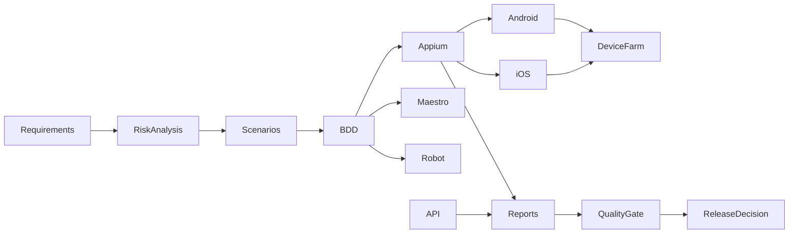

# Mobile Quality Engineering Lab

A senior-level reference implementation for mobile quality engineering, designed to demonstrate how a QA/SDET team can structure automation, risk-based validation, CI evidence, and release confidence for critical mobile journeys.

> This repository is a portfolio project focused on practical engineering quality work: test architecture, pipeline design, observability, release gating, and automation strategy for Android and iOS.

## Overview

This lab models a financial-style mobile workflow with emphasis on authentic user journeys such as authentication, dashboard validation, and high-risk transaction flows. It combines Appium, API testing, BDD, quality gates, device farm strategy, and structured evidence generation in one reusable engineering reference.

## Business Problem

Critical mobile journeys need resilience across device fragmentation, operating system variability, and evolving release pressures. The project demonstrates how a quality engineering team can reduce uncertainty through risk-based coverage, automation design, and evidence-driven quality decisions.

## Architecture Summary



## Core Capabilities

- TypeScript-first automation foundation with strict validation
- Appium 2 + WebdriverIO architecture with Screen Object Pattern
- API contract and negative testing using axios-based clients
- Schema validation for payload integrity
- Retry and failure-policy patterns for resilient service calls
- JUnit and JSON reporting for CI evidence publication
- Azure DevOps pipeline support with artifact publication
- Cloud device farm strategy for Android and iOS matrix execution

## Tech Stack

- Node.js LTS + TypeScript
- Appium 2 + WebdriverIO
- UiAutomator2 and XCUITest capability strategy
- Maestro for lightweight smoke flow validation
- Robot Framework + AppiumLibrary for keyword-driven execution
- Axios-based API testing and schema validation
- Vitest for unit and contract-level checks
- Azure DevOps pipeline structure
- BrowserStack, Firebase Test Lab, and AWS Device Farm strategy

## Test Strategy

The project organizes testing around business risk and release confidence. Authentication and transactional flows receive higher priority than low-risk exploratory paths, and the automation suite reflects that prioritization.

## Quality Strategy

- Smoke checks validate critical path reachability
- API contract tests cover positive and negative paths
- Regression checks protect high-risk flows
- Device farm strategy expands coverage beyond local infrastructure
- Evidence bundles support release gate decisions

## Appium Architecture

- Screen Object Pattern for maintainability
- BaseScreen abstraction with explicit waits and reusable actions
- Stable selectors and resilient interaction patterns
- Screenshot capture during failure scenarios
- Structured logging for CI and debugging workflows

## API Testing Architecture

- Base API client for consistent HTTP usage
- Contract tests for GET/POST/PUT/DELETE behaviors
- Retry logic for transient service failures
- Schema validation to reduce malformed payload risk

## Device Farm and CI Strategy

- Local/CI validation for fast feedback on PRs
- Nightly cloud runs over a representative device matrix
- Release validation based on evidence bundle and environment-specific thresholds

## Quality Gates

- Smoke Tests = 100%
- Critical Tests >= 98%
- Regression >= 95%
- No blocker defects
- No critical defects

## Environment Gates

- `local`: fast developer feedback
- `ci`: required for PR and merge eligibility
- `nightly`: required for cloud device matrix validation
- `release`: required for deployment promotion

## Observability and Reporting

The project includes structured reporting for pipeline evidence, JUnit test outputs, screenshots, and execution metadata. This supports a real engineering quality story rather than a static tutorial-only repo.

## How to Run

```powershell
npm install
npm run setup:check
npm run lint
npm run typecheck
npm run test:api
npm run test:smoke
node scripts/generate-report.js
```

For Android, configure Android Studio, set ANDROID_HOME, and ensure adb is available. For iOS and cloud validation, use macOS or a real device farm because direct local iOS execution is not realistic on Windows.

## Project Structure

```text
appium/
api/
maestro/
robot-framework/
bdd/
performance/
device-farm/
scripts/
reports/
docs/
azure-pipelines.yml
README.md
PROJECT_STATUS.md
```

## Verified Status

The repository has been validated in the current environment with the following checks:

- ESLint passed
- TypeScript strict validation passed
- API contract tests passed
- Mobile smoke/regression checks passed
- Release gate evaluation passed for local, CI, nightly, and release thresholds

## Portfolio Positioning

This repository is suitable for demonstrating:

- mobile quality engineering design and architecture
- test automation strategy and risk prioritization
- CI/CD evidence and release gates
- device farm planning and multi-environment execution
- practical SDET / Quality Engineer portfolio depth

## Lessons Learned

- Deterministic selectors and explicit waits improve mobile reliability.
- Risk-based prioritization creates better release confidence than broad but shallow coverage.
- Evidence-based quality gates are more valuable than ad hoc manual approval.
- CI and cloud execution must be designed around real device variability and artifact retention.
