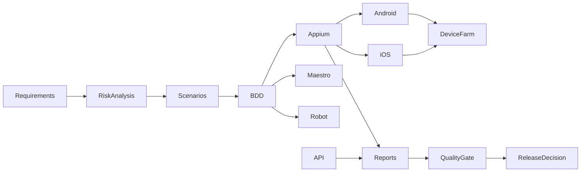

# Laboratório de Quality Engineering Mobile

Implementação de referência em nível sênior para quality engineering mobile, criada para demonstrar como uma equipe de QA/SDET pode estruturar automação, validação orientada a risco, evidências de CI e confiança de release para jornadas móveis críticas.

> Este repositório é um projeto de portfolio focado em trabalho prático de qualidade de engenharia: arquitetura de testes, desenho de pipeline, observabilidade, release gates e estratégia de automação para Android e iOS.

## Visão geral

Este laboratório modela um fluxo mobile com estilo financeiro, com ênfase em jornadas reais do usuário, como autenticação, validação de dashboard e fluxos de transação de alto risco. Ele combina Appium, testes de API, BDD, quality gates, estratégia de device farm e geração estruturada de evidências em uma referência reutilizável de engenharia.

## Problema de negócio

Jornadas móveis críticas precisam ser resilientes diante da fragmentação de dispositivos, da variabilidade de sistemas operacionais e da pressão evolutiva de release. O projeto demonstra como uma equipe de quality engineering pode reduzir incertezas por meio de cobertura orientada a risco, desenho de automação e decisões baseadas em evidência.

## Resumo da arquitetura



## Capacidades principais

- base de automação em TypeScript com validação rigorosa
- arquitetura Appium 2 + WebdriverIO com Screen Object Pattern
- testes de contrato e cenários negativos com clientes baseados em axios
- validação de schema para integridade de payload
- padrões de retry e política de falhas para serviços resilientes
- relatórios em JUnit e JSON para publicação de evidência no CI
- suporte a pipeline em Azure DevOps com publicação de artefatos
- estratégia de device farm em nuvem para execução em matriz Android e iOS

## Stack tecnológica

- Node.js LTS + TypeScript
- Appium 2 + WebdriverIO
- estratégia de capacidades UiAutomator2 e XCUITest
- Maestro para validação leve de smoke flow
- Robot Framework + AppiumLibrary para execução keyword-driven
- testes de API com Axios e validação de schema
- Vitest para verificações unitárias e de contrato
- estrutura de pipeline em Azure DevOps
- estratégia com BrowserStack, Firebase Test Lab e AWS Device Farm

## Estratégia de testes

O projeto organiza os testes em torno de risco de negócio e confiança de release. Fluxos de autenticação e transacionais recebem prioridade mais alta do que caminhos exploratórios de baixo risco, e a suíte de automação reflete essa priorização.

## Estratégia de qualidade

- smoke checks validam alcance do caminho crítico
- testes de contrato de API cobrem cenários positivos e negativos
- regressões protegem fluxos de alto risco
- estratégia de device farm amplia cobertura além da infraestrutura local
- bundles de evidência sustentam decisões de quality gate

## Arquitetura Appium

- Screen Object Pattern para manutenção
- abstração BaseScreen com waits explícitos e ações reutilizáveis
- seletores estáveis e padrões resilientes de interação
- captura de screenshot em cenários de falha
- logging estruturado para workflows de CI e depuração

## Arquitetura de testes de API

- cliente base de API para uso consistente de HTTP
- testes de contrato para comportamentos GET/POST/PUT/DELETE
- lógica de retry para falhas transitórias
- validação de schema para reduzir risco de payload malformado

## Estratégia de Device Farm e CI

- validação local/CI para feedback rápido em PRs
- execuções em nuvem nightly sobre matriz representativa de dispositivos
- validação de release baseada em bundle de evidência e thresholds por ambiente

## Quality Gates

- Smoke Tests = 100%
- Critical Tests >= 98%
- Regression >= 95%
- Sem defects bloqueadores
- Sem defects críticos

## Environment Gates

- local: feedback rápido para desenvolvimento
- ci: obrigatório para elegibilidade de PR e merge
- nightly: obrigatório para validação de matriz em device farm
- release: obrigatório para promoção de deploy

## Observabilidade e relatórios

O projeto inclui relatórios estruturados para evidência de pipeline, saídas JUnit, screenshots e metadados de execução. Isso sustenta uma história real de qualidade de engenharia em vez de um repositório estático de tutorial.

## Como executar

```powershell
npm install
npm run setup:check
npm run lint
npm run typecheck
npm run test:api
npm run test:smoke
node scripts/generate-report.js
```

Para Android, configure o Android Studio, defina ANDROID_HOME e garanta que adb esteja disponível. Para iOS e validação em nuvem, utilize macOS ou um device farm real, porque execução local direta de iOS não é realista em Windows.

## Estrutura do projeto

```text
appium/
api/
maestro/
robot-framework/
bdd/
performance/
device-farm/
scripts/
reports/
docs/
azure-pipelines.yml
README.md
PROJECT_STATUS.md
```

## Status verificado

O repositório foi validado no ambiente atual com os seguintes checks:

- ESLint concluído com sucesso
- validação estrita de TypeScript concluída
- testes de contrato de API aprovados
- checks de smoke/regressão mobile aprovados
- avaliação de release gate concluída para thresholds de local, CI, nightly e release

## Pilares de maturidade profissional

Este projeto foi estruturado para reforçar quatro pilares essenciais de um time de Quality Engineering profissional:

- Evidência real: as decisões de qualidade são apoiadas por artefatos, relatórios, validações e evidência de execução em pipeline.
- Execução prática: a solução demonstra como automatizar fluxos críticos, integrar API e mobile e validar riscos reais de release.
- Narrativa de negócio: o projeto conecta testes e automação à experiência do usuário, ao valor do produto e ao impacto de falhas em jornadas críticas.
- Governança de qualidade: gates por ambiente, critérios de qualidade, mecanismos de revisão e política de decisão de release são tratadas como parte do processo, e não como etapa informal.

Esses pilares tornam o repositório mais do que um laboratório de tecnologia: ele passa a funcionar como uma prova de capacidade de operar qualidade em contextos reais de entrega mobile.

## Posicionamento de portfolio

Este repositório é adequado para demonstrar:

- arquitetura e desenho de quality engineering mobile
- estratégia de automação e priorização por risco
- evidência de CI/CD e release gates
- planejamento de device farm e execução multi-ambiente
- profundidade prática para portfolio de SDET / Quality Engineer

## Lições aprendidas

- seletores determinísticos e waits explícitos melhoram a confiabilidade mobile
- priorização baseada em risco gera mais confiança de release do que cobertura ampla e superficial
- quality gates baseados em evidência são mais valiosos do que aprovação manual ad hoc
- CI e execução em nuvem precisam ser desenhados para variabilidade real de dispositivos e retenção de artefatos.
